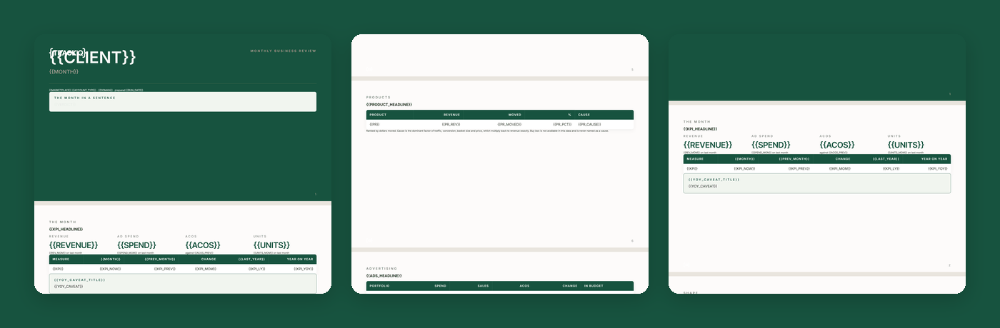

# TrackIQ: Amazon Monthly Business Review

The retention artifact. **The month in one deck**, in a form a brand manager can forward to their own leadership without editing it.

Output is a branded 1920x1080 HTML deck, same format as the AMC media mix deck.

Part of **Amazon Management & Operations** in the
[TrackIQ skills catalog](https://github.com/TrackIQ-HQ/amazon-seller-skills).

Built as an [Agent Skill](https://code.claude.com/docs/en/skills). Runs in
Claude Code, Claude web, Claude desktop and ChatGPT from the same folder.

---

## Powered by the TrackIQ MCP

[](https://trackiq.com/mcp)

This skill reads your live Amazon account through the
**[TrackIQ MCP](https://trackiq.com/mcp)** — 16 tools connecting your AI
assistant to Amazon data:

Sales & Traffic · Orders · Inventory · Returns · Sponsored Products · Sponsored
Brands · Sponsored Display · Amazon DSP · AMC Cloud · Keywords · Search Terms ·
Targeting · Search Query Performance · Organic Rank · Best Seller Rank · Buy Box
History · Brand Analytics · Export

Works with Claude, ChatGPT and Cursor. **[Get access →](https://trackiq.com/mcp)**

---

## What you get



Builds the month-end client deck for one Amazon brand — revenue and spend against the previous month and the same month last year, the organic and paid split, category and product mix, what moved and why, and a prioritised plan for next month. Checks that last year's ad data actually exists before drawing a year-on-year comparison. Use when the user asks for a monthly business review, MBR, month-end deck, monthly client report, end of month summary, or the monthly review presentation.

### The rules that keep it honest

- **Revenue reconciles across every slide**
- **No slide content below the footer safe zone**
- **Three comparisons, no more:**
- **Every claim on a narrative slide traces to a number on a data slide**

The full list is in `SKILL.md`, and each one exists because getting it wrong
produces a confident, wrong answer rather than an obvious error.

## Requirements

- The TrackIQ MCP, for `list_marketplaces`, `get_account_overview`, `get_product_performance`, `get_campaigns`, `get_portfolios` and `get_product_categories_performance`. - Nothing else. No filesystem, no shell, no internet. - **Without the MCP:** works from monthly exports of sales, spend and ASIN performance for the three periods being compared.

---

## Install

### Claude Code

```
/plugin marketplace add TrackIQ-HQ/amazon-seller-skills
/plugin install trackiq-amazon-monthly-business-review@trackiq
```

### Claude web, desktop, mobile

1. Download the `.zip` from the
   [latest release](https://github.com/TrackIQ-HQ/trackiq-amazon-monthly-business-review/releases)
2. **Settings → Capabilities → Skills** (code execution must be on)
3. **Create skill → Upload a skill**, choose the `.zip`
4. Toggle it on

### ChatGPT

Same zip. **Plugins → Skills → Create → Upload from your computer.**

---

## Setup

Answers live in `account.md`, copied from
[`assets/account.example.md`](skills/trackiq-amazon-monthly-business-review/assets/account.example.md).
**Every TrackIQ skill reads the same file**, so an account already set up for
another TrackIQ report needs nothing added.

## Delivery

Asked once and stored in `account.md`: **in-chat** (default), **file**,
**Slack**, **n8n** or **email**. Anything leaving the chat confirms with you
first and falls back to in-chat, with a note.

---

## Customizing

| File | What it controls |
|---|---|
| `checks.md` | the pre-send checks |
| `deck-template.html` | the report shell |
| `narrative.md` | reference detail |
| `pulls.md` | the call sequence and its traps |

---

## Contributing

```bash
python scripts/validate.py    # must exit 0 before any commit
python scripts/build.py       # writes dist/ zip + registry.json
```

Read [AUTHORING.md](https://github.com/TrackIQ-HQ/amazon-seller-skills/blob/main/AUTHORING.md)
before proposing changes.

## License

MIT. See [LICENSE](LICENSE).
